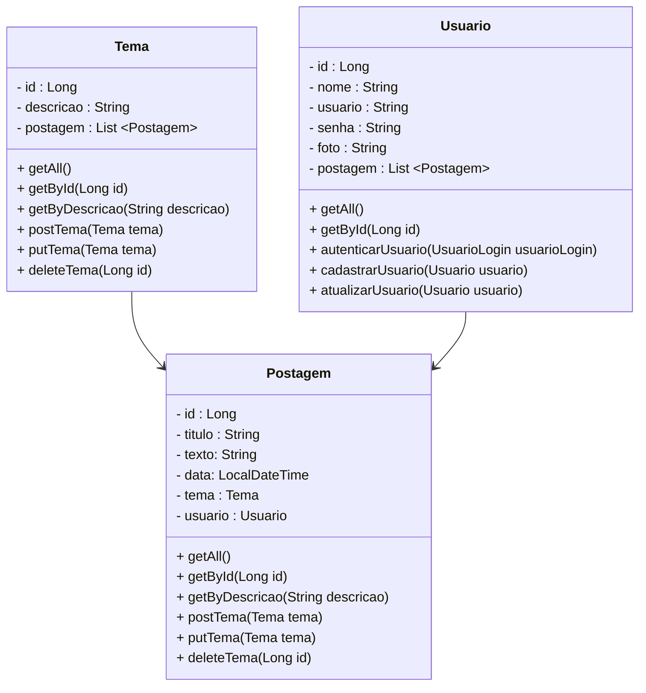

# Projeto Blog Pessoal

 

     
    <strong>trilha</strong>
    

  

## Diagrama de Classes

  

# Referências sobre Spring

 

<a href="https://spring.io/" target="_blank">Documentação Oficial do Spring</a>

<a href="https://maven.apache.org/" target="_blank">Documentação Oficial do Maven</a>

<a href="https://mvnrepository.com/" target="_blank">Repositório do Maven</a>

<a href="https://www.baeldung.com/" target="_blank">Baeldung</a>

<a href="https://blog.algaworks.com/" target="_blank">Blog da Algaworks</a>

<a href="https://www.michellibrito.com/" target="_blank">Michelli Brito</a>
